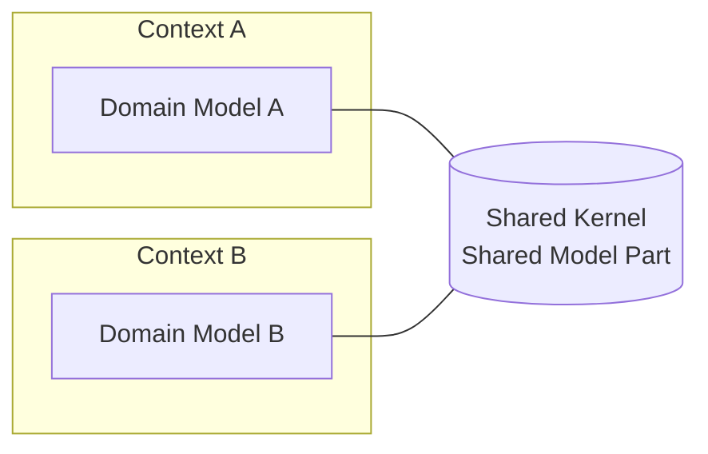

# Understanding Context Mapping

## Shared Kernel- A Common Ground

> Two contexts share a part of the model, requiring close coordination and trust between teams.

```mermaid
flowchart LR
  subgraph C1["Context A"]
    A1[Domain Model A]
  end

  subgraph C2["Context B"]
    B1[Domain Model B]
  end

  SK[(Shared Kernel<br/>Shared Model Part)]

  A1 --- SK
  B1 --- SK
```

    
