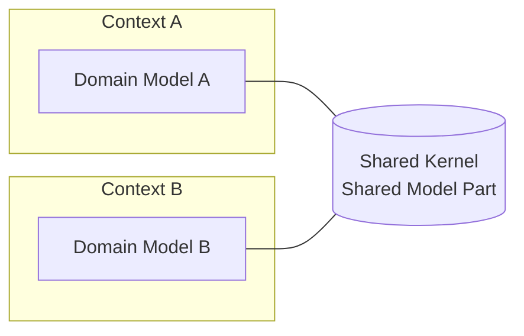
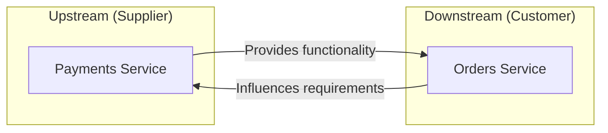
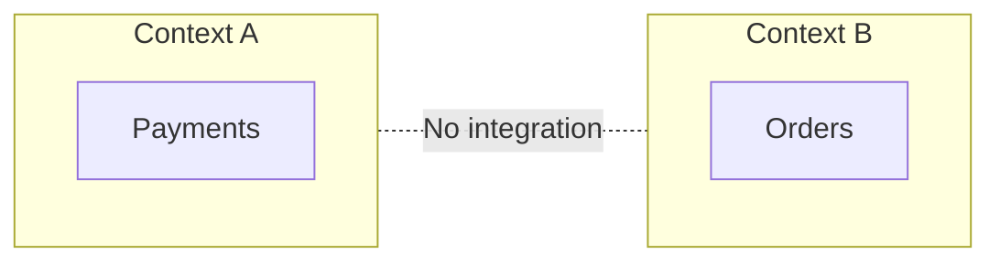
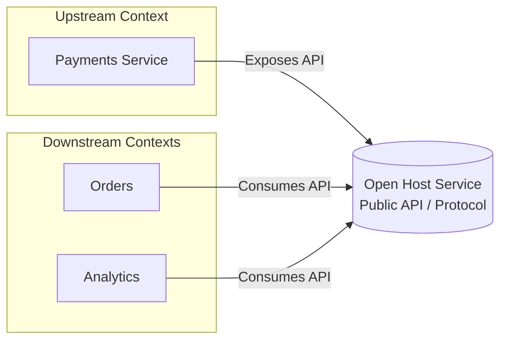

# Understanding Context Mapping

## Shared Kernel- A Common Ground

> Two contexts share a part of the model, requiring close coordination and trust between teams.



## Customer–Supplier

> The downstream (customer) depends on the upstream (supplier) and can influence its priorities or features.



## Conformist

> The downstream has no influence and must fully adapt to the upstream model as it is.


```mermaid
flowchart LR
  subgraph U["Upstream Context"]
    U1[Payments]
  end

  PL[(Published Model / Contract)]

  subgraph D["Downstream Context"]
    D1[Orders]
  end

  U1 -- "Owns & defines" --> PL
  D1 -- "Conforms to" --> PL
  D1 -. "No influence on Upstream" .- U1
  D1 -. "No influence on Downstream" .- U1
  ```

## Anticorruption Layer

> The downstream isolates its domain by translating the upstream model, preventing external concepts from leaking in.


```mermaid
flowchart LR
subgraph U["Upstream Context"]
U1[Payments]
end

subgraph D["Downstream Context"]
D1[Orders]
end

ACL["`Anticorruption Layer`"]

U1 -- "Provides Model" --> ACL
ACL -- "Translates & Protects" --> D1
D1 -. "Own domain language preserved" .- D1
 ```

## Published Language

> Teams agree on a shared, well-defined communication language or schema to integrate smoothly.
 
```mermaid
flowchart LR
  subgraph U["Upstream Context"]
    U1[Payments Supplier]
  end

  PL[(Published Language<br/>OpenAPI / Avro / JSON Schema)]

  subgraph D["Downstream Contexts"]
    D1[Orders Customer]
    D2[Analytics]
    D3[Billing Reconciliation]
  end

  U1 -- Publishes --> PL
  D1 -- Consumes --> PL
  D2 -- Consumes --> PL
  D3 -- Consumes --> PL
```

## Separate Ways

> Contexts remain isolated, evolving independently without integration.



## Open Host Service

> The upstream provides a well-defined API or protocol that multiple downstreams can consume without tight coupling.

