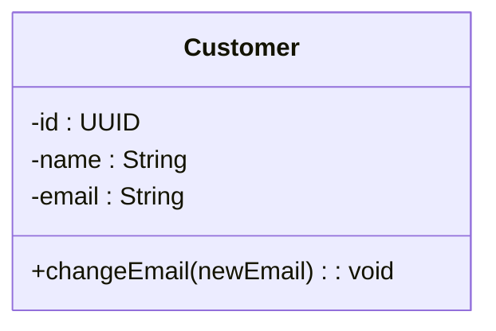
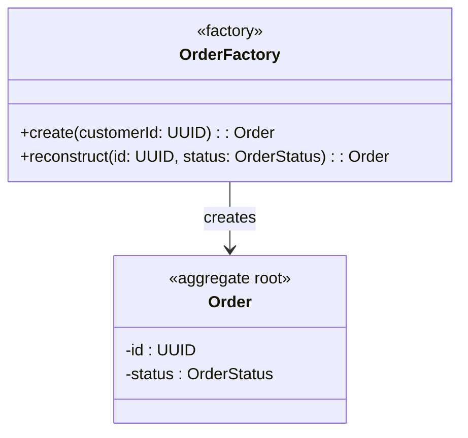
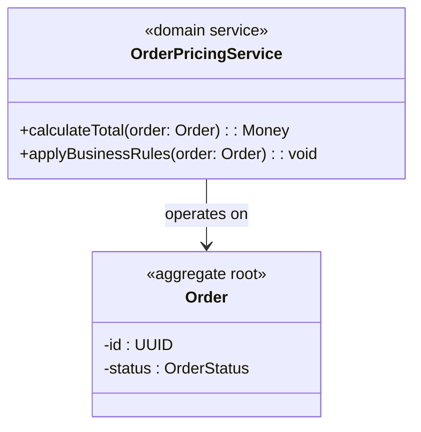
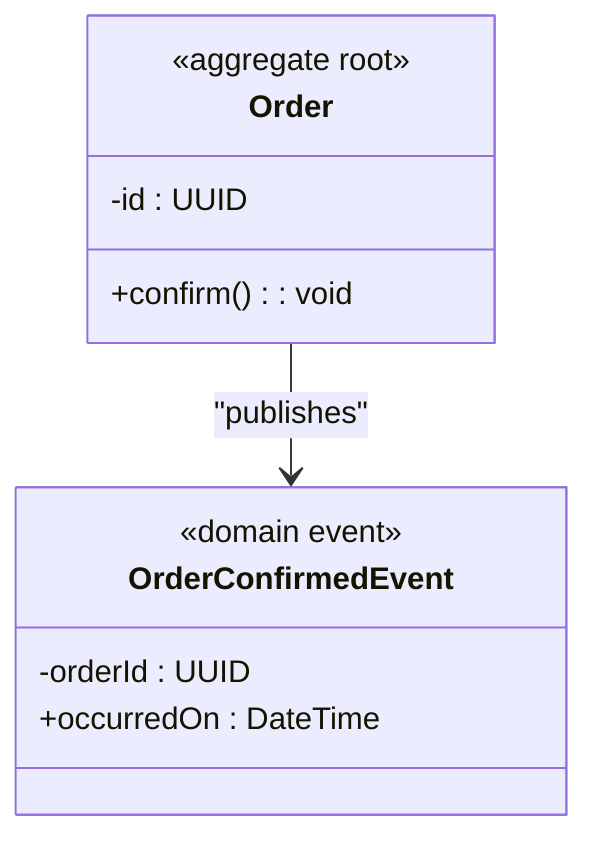
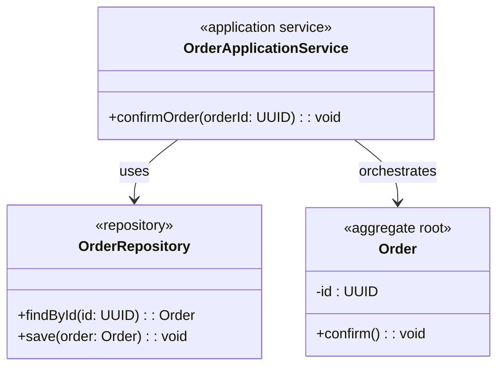

# 2 Tactic Patterns

To see the diagrams properly, please open them in [Mermaid Live Editor](https://mermaid-js.github.io/mermaid-live-editor).

Or you can use the following link: [See at Github Page](https://github.com/o-s-expert/ddd-workshop/blob/main/guides/docs/02_tactic_pattern.md)

## Entity – Identity Matters

> An object defined by a unique identity that persists over time, even if its attributes change.

## Value Object – Essence over Identity

> An immutable object defined solely by its attributes; equality is based on value rather than identity.

## Aggregate – Consistency Boundary

> A cluster of entities and value objects treated as a single unit, with a root entity ensuring business rules and consistency.

## Repository – Gateway to Aggregates

> An abstraction that provides controlled access to aggregates, handling persistence while keeping the domain pure.

## Factory – Controlled Creation

> A mechanism that encapsulates complex creation logic, ensuring invariants are satisfied when building aggregates or entities.

## Domain Service – Logic Without a Home

> Encapsulates domain behavior that does not naturally belong to an entity or value object, but is still part of the core domain.

## Domain Event – Something Happened

> Represents a significant occurrence in the domain, capturing a past fact and enabling communication across the system.

## Application Service - Orchestrating Use Cases

> An application service coordinates workflows by invoking domain objects and repositories, ensuring the correct sequence of operations. It manages transactions, orchestration, and security while delegating all business rules to the domain layer, keeping the domain pure and exposing use cases to the outside world.

