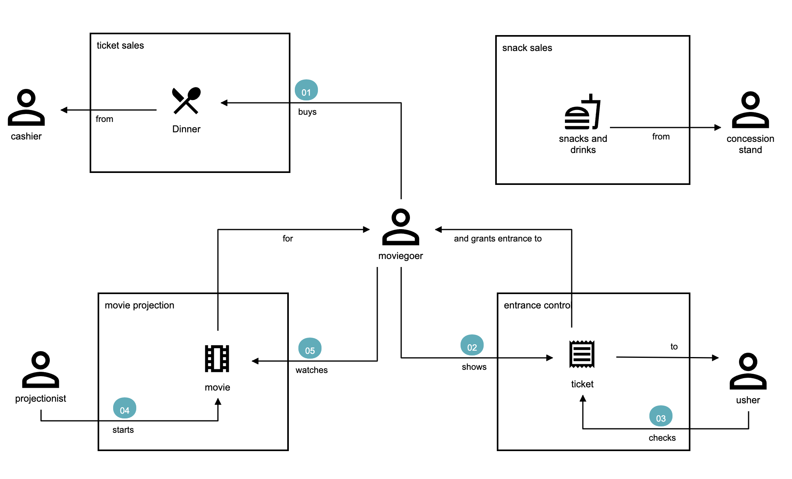

# 3rd Action, the Movie: Establishing Boundaries and Context Mapping  

In this exercise you will see how the concepts of **bounded context** and **context mapping** can be applied in real life. 

!!! note "Roll up your sleeves, and get to action!"

    It's time to practice what you have learned and get your hands. Roll up your sleeves and let's get to action!

## Exercise goals

- [ ] Fix and Complete the domain storytelling diagram (`storytelling/03-cinema`) ;
- [ ] As a developer, explore the existing project (`03-cinema`) and evaluate code design and implementation choices;
- [ ] Implement and test one of the missing features described in the diagram, in the existing application;

The outcome of this practice should be a **diagram** representation of the **Movie** use case and its respective **java service**.

## Scenario

**Business Goal:** As a moviegoer, I want to go to the movie theater, buy a ticket, maybe get some popcorn and soda, and watch the chosen movie.

## Practicing Domain Storytelling

1. Using your browser, access [Egon.io](http://egon.io)
2. Import the diagram located under `ddd-workshop-labs/storytelling/03-cinema.dst`

    **But wait... it looks like there's something wrong with it!**

    

Luckily, we can use your help to help us fix this diagram and reduce bugs on the final application.

### Adjusting the model to match the real user need

Revisit the diagram and identify which are adjustments that must be done to have a real representation of the user's need;

To explore the use case, rely on the instructor (business person representation) to ask questions to the instructor _or_ discussing with other attendees;

Make sure you pay attention to these items and meet the following requirements:
   
- [ ] Some actions are certainly missing in this diagram. (_Which actions should be mapped for the actors, and are not represented?_) 
- [ ] Describe in the diagram, the `sequence order` of each action. (_To change a group sequence, you can double-click on the association arrow and set your input data;_)
- [ ] Are there optional items? Add a `text annotation` to highlight this characteristic. 

    

Once you're satisfied with the domain map, and you feel like it covers the use case story accordingly, you are ready to
move forward and start designing you Java service.
 
Our next step is to check the modeling of the application, matching the implementation with the domain exploration details.

---

## From a Story to the Code: the Cinema service

In the `ddd-workshop-labs` folder, locate and open the project `03-cinema` using your chosen Java IDE;

## Observe and learn 

1. Using your IDE or your terminal, pull the project to make sure you are have the latest version of the `ddd-workshop-labs`.
    ```shell
    cd ddd-workshop-labs
    git pull origin main    
    ```
   
2. Open the test class `expert.os.workshop.ddd.cinema.OrderTest`; 
3. Now notice the following items:
    4. Is this test is validating the user story previously described? If not, what are your ideas to adjust it?
    5. In this unit test, we can notice the following validation:
   
```java linenums="1"
    Movie movie = new Movie("Matrix", Year.of(1999)); //(1)
    Product ticket = new Ticket(movie, Money.of(10, currency)); //(2)
    Product popcorn = new Food("popcorn", Money.of(15, currency));  //(3)
    Order order = Order.of(moviegoer);    //(4)
    
    order.add(ticket); 
    order.add(popcorn); //(5)!
    
    MonetaryAmount total = order.total(); //(6)
    Assertions.assertThat(total) 
            .isEqualTo(Money.of(25, currency)); //(7)
```

1. Creates the `Movie` Matrix, from 1999;
2. The `Ticket` for this `Movie` costs $10;
3. The `Food` available to be bought is a popcorn, and it costs $15;
4. The `Moviegoer` creates a new order; 
5. This person's `Order` includes a `Ticket` for Matrix and his snack, the popcorn.
6. The `Moviegoer` needs to pay for the total amount of this order;
7. Assures the total `Order` cost is compliant to the business rules; 

The test validates one of the paths of our storytelling: _a user should be able to acquire movie theater tickets
and snacks in order to watch the movie._

Due to the domain exploration you've done while adjusting the errors on the domain diagram, 
you probably feel comfortable when reading this text - a result of 
the usage of ubiquitous language across business conversations and the technology scope.

Now, before finishing this project's implementation, navigate through the project and notice the following details:

!!! question "Entities such as `Moviegoer` and `Movie` are mapped with `org.jmolecules.ddd.annotation.@Entity`. How can this annotation be helpful?"

The products sold by this movie theater are defined by the `Interface` named `Product`. 
```java
public record Food (String name, MonetaryAmount price) implements Product {}
public record Ticket (Movie movie, MonetaryAmount price) implements Product { }
```

Notice that by relying on the power of abstraction and CDI, adding a new product using the `Order` class is really simple: 
either while writing, reading or maintaining the code.

```java linenums="1"
public void add(Product product) { //(1)
  Objects.requireNonNull(product,"product is required");
  this.products.add(product);
}
```

4. If new products are made available, the impacts on the `Order` class should be minimal to none;

## Testing the Movie Service

Now, make sure your project is working just fine.

1. Run the following commands:

    ```java
    cd 03-cinema
    mvn clean package 
    ```

You should see one test executed successfully, as well as the project build.  
```shell
-------------------------------------------------------
[INFO] Running expert.os.workshop.ddd.cinema.OrderTest
Mar 21, 2023 7:39:08 PM org.javamoney.moneta.DefaultMonetaryContextFactory createMonetaryContextNonNullConfig
INFO: Using custom MathContext: precision=256, roundingMode=HALF_EVEN
[INFO] Tests run: 1, Failures: 0, Errors: 0, Skipped: 0, Time elapsed: 0.067 s - in expert.os.workshop.ddd.cinema.OrderTest
[INFO] 
[INFO] Results:
[INFO] 
[INFO] Tests run: 1, Failures: 0, Errors: 0, Skipped: 0
[INFO] 
[INFO] ------------------------------------------------------------------------
[INFO] BUILD SUCCESS
[INFO] ------------------------------------------------------------------------
[INFO] Total time:  1.407 s
[INFO] Finished at: 2023-03-21T19:39:09-03:00
[INFO] ------------------------------------------------------------------------
```

Now, let's expand our implementation and certify the benefits of the Domain Storytelling practice and an application designed
and developed through DDD principles. 

----

### Expanding the implementation

Now, as a developer who recently joined the team, you've learned about the use case through the **Domain Storytelling** 
practice.

#### Next step: choosing the next implementation

At this stage, having looked at the domain diagram and existing code, do you feel comfortable when asked to 
identify which features are still missing and choosing one to implement?

For example. As of now, the Movie Service provides the following capability:

> A `Moviegoer` registers an `Order` containing a `Ticket` and `Food`, and is informed the total cost;

!!! question "Can you identify more scenarios to be implemented, based on the diagram `03-cinema`?"

Now, let's go back to coding. 

#### Next step: choosing the next implementation

- [ ] Choose one of the discussed scenarios to implement in the `03-movie` application; 
- [ ] Use as much as you can, the terminology described in the domain diagram;
- [ ] Implement a unit test to confirm your solution is working. 

If you need some help, next is some guidance to support you on this task. If you feel comfortable, we recommend you to try to identify and add the
next enhancement based on your interpretation and coding only. 

#### Enhancement: Allow customers to buy beverages

As of now, we only support orders with `Food`. Let's add the `Beverage` to our solution.
 
1. Let's start with the unit test, as stated by TDD (Test Driven Development) practices. 
Open the `test.java.expert.os.workshop.ddd.cinema.OrderTest` class;
2. Add a new unit test called `shouldSumTotalWithBeverage`; Don't forget the "`@Test`" annotation.
3. The test can look like this:
    
    ```java linenums="40"
        @Test
        public void shouldTotalWithBeverage() {
            Movie movie = new Movie("Avatar", Year.of(2022));
            Product ticket = new Ticket(movie, Money.of(10, currency));
            Product popcorn = new Food("popcorn", Money.of(15, currency));
            Product soda = new Beverage("soda", Money.of(5, currency));  //(1)
            Order order = Order.of(moviegoer);
    
            order.add(ticket);
            order.add(popcorn);
            order.add(soda); //(2)
    
            MonetaryAmount total = order.total();
            Assertions.assertThat(total)
                    .isEqualTo(Money.of(30, currency)); //(3)
        }
    ```

    1. Creates a new beverage abstrated as a product
    2. Adds the beverage "soda" to the order;
    3. Asserts that the total now includes the beverage cost;

#### Adding the beverage model

Now, your application is breaking, as expected. It's time to create the entity `Beverage`.

1. In the package `expert.os.workshop.ddd.cinema`, create a new class called `Beverage.java`. It can look as the sample below. 
Notice we can rely on the `Product` interface to garantee it will behave as expecteed for a `Product` in this domain.
```java
package expert.os.workshop.ddd.cinema;

import javax.money.MonetaryAmount;

public record Beverage (String name, MonetaryAmount price) implements Product { }
```
2. Using your IDE or a command line, run the maven test and check the resulting output.
    ```shell
    mvn clean test
    ```

Did it work? Why did the price was correctly calculated even though we didn't add new business logic to the order?

----
## Congratulations!
You've done a great job so far. Let's keep on adding new concepts and technologies to our exercises.
