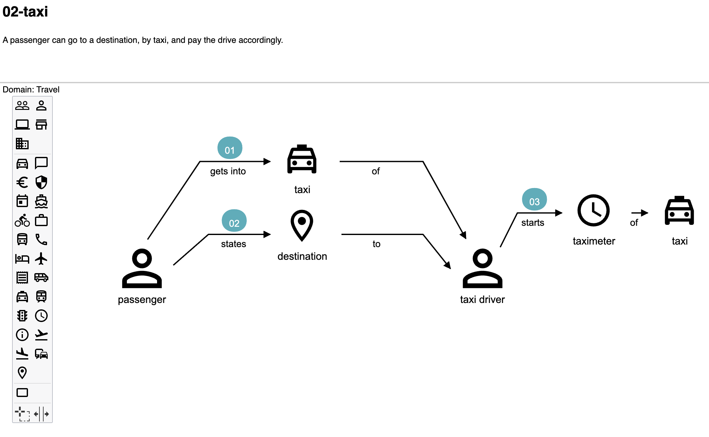

# 2nd Action, the Taxi: a Domain Storytelling exercise 

In this exercise you can validate and practice your knowledge of the following concepts:

* Mapping interaction between multiple `Actors`;
* Multiple `Work Objects` used through several actions `ordered` and mapped with `associations`;
* Model the service using the domain storytelling as the source of knowledge;

!!! note "Roll up your sleeves, and get to action!"

    It's time to practice what you have learned and get your hands. Roll up your sleeves and let's get to action!
## Exercise goals

In this practice, you'll have three tasks:

- [ ] **1. Understanding the business need** and,
- [ ] **2. Mapping the domain** components using Domain Storytelling;
    * [ ] Map the main `Actor`
    * [ ] Map expected `Actions` taken by the actors
    * [ ] Number the `order` in which these actions happen
    * [ ] Map any `objects` the elements involved
    * [ ] Track the `Domain Language`
- [ ] **3. Design a Java service** using your discoveries.
    * [ ] Design and create a Java project based on the Domain Storytelling.
    * [ ] Use the domain language

## Scenario

**Business Goal:** A passenger can go to a destination, by taxi, and pay the drive accordingly.

--- 
## Practicing Domain Storytelling

Now, explore the use case asking the business person at hand (_chosen by the instructor_) about 
how this user story. Use [Egon](https://egon.io/) to map the domain elements.

The outcome of this practice should be a diagram representation of the **Taxi** use case.

### Getting Started

It's time to start our Domain Storytelling mapping. You can either start from scratch or use a partial implementation to 
help you get started. 

!!! tip "TIP: Shedding light on solutions"

    Start by mapping the `actors` of the domain. How many `Actors` are involved? Who are these `Actors`? Describe the elements,the `Work Objects` of the story. Items such as _Destination_, _Taxi_, _Fare_, and _Taximeters_ are examples of `Work Objects` in this domain. Don't forget to add the `sequence` numbers to clarify how this story's actions flow.  

1. Using your browser, access [Egon.io](http://egon.io)
2. Import the diagram located under `ddd-workshop-labs/storytelling/02-taxi.dst`
    
3. Complete the domain by exploring the use case, asking questions or discussing with other attendees;

Once you're satisfied with the domain map, and you feel like it covers the use case story accordingly, you are ready to
start designing you Java service.
 
Our next step is to practice the modeling of the application, matching the implementation with the domain exploration details.

---

## A Story becomes Code: Creating the Java service


1. In the `ddd-workshop-labs` folder, locate and open the project `02-taxi` using your chosen Java IDE;
2. Create the Java entities required by your use case - your implementation should match your domain model. 
3. The models can be created under `02-taxi/src/main/java/expert/os/workshop/ddd/taxi`
4. Unit tests, can be created under `02-taxi/src/test/java/expert/os/workshop/ddd/taxi`


Here are some examples and ideas to help you get started:
    * The domain diagram describes entities we can model. Examples: `Passenger`, `Driver`, `Ride`, `Taximeter` and `Car`. 
    * These entities relate to each other, and the model's actions can actually become `methods` and associations between these classes. 
      * For example, a `Passenger`, has many `Rides`;
      * It should be possible to set a `destination` of a `Ride`;
      * The `Taximeter` can be used by the `Driver` to `flag` the ride as economic or expensive.
    
The unit tests can help you validate if your code is behaving as you expect. The Test class is pretty simple and helpful on the developement process. 

Below is an example of a test class - remember that story's interpretation are unique, therefore, your implementation is also unique!;
```java
package expert.os.workshop.ddd.taxi;

import org.assertj.core.api.Assertions;
import org.junit.jupiter.api.BeforeEach;
import org.junit.jupiter.api.Test;

import javax.money.MonetaryAmount;
import java.time.LocalTime;

import static expert.os.workshop.ddd.taxi.Taximeter.ECONOMIC;
import static expert.os.workshop.ddd.taxi.Taximeter.EXPENSIVE;
import static org.junit.jupiter.api.Assertions.*;

class TaximeterTest {

    private Taximeter taximeter;

    @BeforeEach
    public void setUp() {
        this.taximeter = new Taximeter();
    }

    @Test
    public void shouldUseEconomicFlag() {
        LocalTime time = LocalTime.of(9, 0);
        Ride economic = new Ride("Aiport", "house", 1, time);
        MonetaryAmount amount = taximeter.fare(economic);
        Assertions.assertThat(amount).isNotNull().isEqualTo(ECONOMIC);
    }
} 
```

These insights should help you understand what are the expected classes to have, methods and associations.


